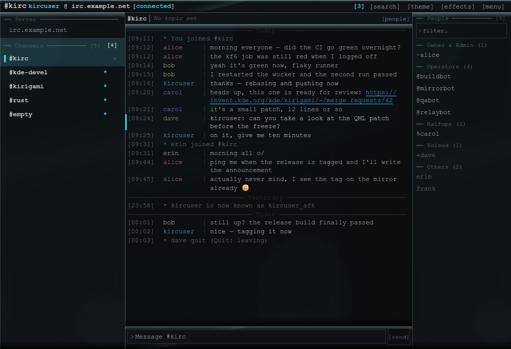
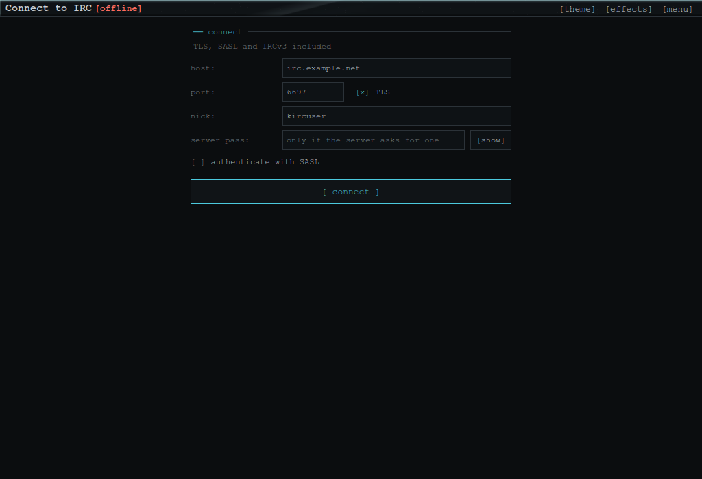
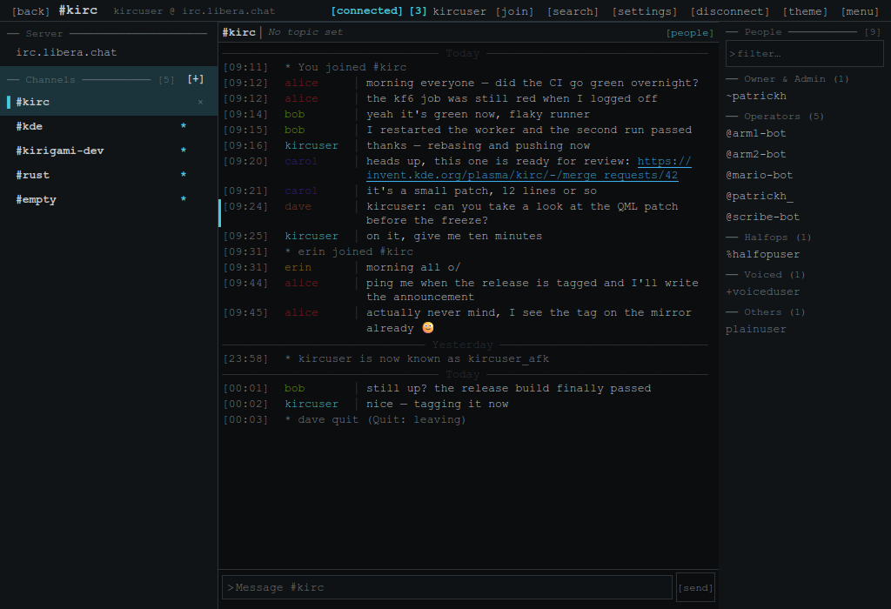
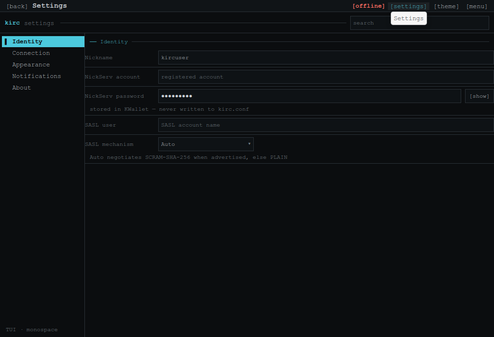

# kIRC

A terminal-styled **IRCv3 client for KDE Plasma**. The protocol engine is Rust, the UI is
Kirigami/QML, and the two are joined by a CXX-Qt bridge. It is deliberately a *console*:
one monospace font, flat surfaces, aligned columns, box-drawing rules — no bubbles, no
avatars, no rounded cards.



## Contents

- [Features](#features)
- [Requirements](#requirements)
- [Build](#build)
- [Run](#run)
- [Install](#install)
- [Configuration](#configuration)
- [Commands](#commands)
- [Architecture](#architecture)
- [Testing](#testing)
- [License](#license)

## Features

**IRCv3** — requested and negotiated at connect: `server-time`, `message-tags`,
`account-tag`, `extended-join`, `batch`, `echo-message`, `chathistory`, `sasl`, plus
`MONITOR`, `SETNAME` and `draft/markread` where the network offers them. SASL supports
**PLAIN, SCRAM-SHA-256 and EXTERNAL**; the mechanism is selectable (default: negotiate
SCRAM-SHA-256 when advertised, otherwise PLAIN).

**Login** — identify on connect via SASL or NickServ (account + password), then autojoin.
If the nick was taken, the client falls back and can reclaim it: once identified it issues
`GHOST` + `NICK` for your account exactly once per connection.



**Console log**

```
[09:11] alice    │ morning everyone — did the CI go green overnight?
[09:31] * erin joined #kirc
[09:44] * alice waves
[17:41] ! 473 #pain Cannot join channel (+i)
──── Today ────────────────────────────────────────
```

Fixed time gutter, aligned nick column, hanging indent on wrapped lines, muted `*` event
rows, day rules, and failures in a warning colour with a `!` marker instead of `*`.
Nicknames are coloured deterministically from a hash, and highlight lines get an accent
bar. Message grouping and day boundaries are computed in the model, so a row costs the
same whether the buffer holds ten lines or ten thousand.

**Themes** — five built-in monospace palettes: `tui` (default), `phosphor`, `amber`,
`ice`, and `breeze` (which follows your Plasma colour scheme). Font family and size are
adjustable.



**Settings** — a two-pane terminal surface with live search: identity (nickname, NickServ
account/password, SASL user and mechanism), connection (server password, autojoin list,
on-join history limit, reconnect policy, default part/quit reason), appearance, and
notification toggles.



**Desktop integration** — KConfig for preferences, KNotifications for highlights and
private messages (honouring Plasma's Do-Not-Disturb), and a KStatusNotifierItem tray icon
with an unread badge, quick connect/disconnect and hide-to-tray.

## Requirements

- Qt 6 (Core, Gui, Widgets, Qml, Quick, QuickControls2)
- KDE Frameworks 6: Kirigami, Config, Notifications, StatusNotifierItem, Wallet
- Rust (edition 2021 toolchain) and Cargo
- CMake 3.21+ and a C++17 compiler
- `qqc2-desktop-style` at runtime (Kirigami uses it for the native widget style)

On Fedora the build dependencies are:

```
sudo dnf install cmake gcc-c++ rust cargo qt6-qtbase-devel qt6-qtdeclarative-devel \
    kf6-kirigami-devel kf6-kconfig-devel kf6-knotifications-devel \
    kf6-kstatusnotifieritem-devel kf6-kwallet-devel
```

## Build

```sh
cmake -S . -B build
cmake --build build -j"$(nproc)"
```

CXX-Qt is fetched automatically by CMake if it is not already installed. The Rust engine
(`rust/core`) is a plain crate with no Qt dependency and can be built or tested on its
own:

```sh
cargo test --offline --manifest-path rust/core/Cargo.toml
```

## Run

```sh
./build/kIRC
```

## Install

`cmake --install` installs the binary, the desktop entry, the AppStream metainfo, the
notification event definition and the hicolor icons:

```sh
sudo cmake --install build --prefix /usr
```

An RPM spec is provided in `packaging/` for Fedora:

```sh
rpmbuild -bb packaging/kirc.spec
```

Pushing a version tag (`git tag v0.7.0 && git push origin v0.7.0`) builds and publishes
that RPM — plus the source RPM — as a GitHub Release via
`.github/workflows/rpm-release.yml`. The tag is the source of truth: it stamps the spec,
the AppStream metadata, the crate versions and the version the binary reports.

## Configuration

Preferences live in `~/.config/kIRC/kirc.conf`. **Secrets are never written there** — the
NickServ, SASL and server passwords are kept in KWallet (folder `kIRC`), or in memory for
the session only if the wallet is unavailable or locked.

The kIRC theme id is versioned: on upgrade, configs holding a retired stock theme id are
moved to the current default once, and a theme you picked yourself is left alone.

## Commands

Everything is available from the composer; the server console accepts slash commands only.
`/help` prints this list into the active buffer, and Tab completes command names.

### Channels and messages

| Command | Description |
|---|---|
| `/join <#channel> [key]` | join a channel (a bare name gains `#`) |
| `/part [#channel] [reason]` | leave a channel (aliases `/leave`, `/close`, `/wc`) |
| `/topic [#channel] [new topic]` | show or set a channel topic |
| `/names [#channel]` | list channel members |
| `/list [pattern]` | list channels on the network |
| `/invite <nick> [#channel]` | invite someone to a channel |
| `/knock <#channel> [message]` | ask to be invited to a channel |
| `/msg <target> <text>` | send a private message |
| `/query <nick>` | open a private message buffer |
| `/notice <target> <text>` | send a notice |
| `/me <action>` | send an action (alias `/action`) |
| `/ctcp <target> <message>` | send a CTCP query |

### Moderation

| Command | Description |
|---|---|
| `/kick [#channel] <nick> [reason]` | kick a user (alias `/remove`) |
| `/kickban [#channel] <nick> [reason]` | ban and kick a user |
| `/ban [#channel] [mask\|nick]` | ban a mask or nick (no mask: list the bans) |
| `/unban [#channel] <mask\|nick>` | remove a ban |
| `/quiet [#channel] [mask\|nick]` | quiet a mask or nick (no mask: list the quiets) |
| `/unquiet [#channel] <mask\|nick>` | remove a quiet |
| `/mode [#channel] <modes…> [args…]` | set modes (defaults to the active channel) |
| `/op` `/deop` `/voice` `/devoice` `/halfop` `/dehalfop` | `[#channel] <nick> [nick…]` |

### User and server

| Command | Description |
|---|---|
| `/nick <new nick>` | change your nickname |
| `/setname <real name>` | change your real name (IRCv3 SETNAME) |
| `/away [reason]` / `/back` | set or clear away status |
| `/whois [server] <nick>` | user information |
| `/whowas <nick> [count]` | past user information |
| `/who [channel\|mask]` | list users |
| `/userhost` / `/ison <nick> [nick…]` | user@host / online-status replies |
| `/oper <name> <password>` | become an IRC operator |
| `/motd` `/version` `/time` `/ping [target]` | server queries |
| `/quit [reason]` | disconnect from the server |

### IRCv3 and client

| Command | Description |
|---|---|
| `/chathistory [target] [count]` | request scrollback (CHATHISTORY LATEST) |
| `/markread [target]` | mark a buffer read (`draft/markread`) |
| `/monitor +\|- <nick> [nick…] \| list \| status` | watch nicks for online/offline |
| `/account <name> <password>` | services login (NickServ IDENTIFY) |
| `/cap <LS\|LIST\|REQ\|END> [caps…]` | capability negotiation passthrough |
| `/batch <params…>` | raw BATCH passthrough |
| `/help [command]` | this list, or the line for one command |
| `/clear` | clear the active buffer |
| `/echo <text>` | print a local line |
| `/raw <line>` | send a raw IRC line (one line only, alias `/quote`) |

## Architecture

```
rust/core/        protocol engine — no Qt: parser, session state machine, CAP, SASL,
                  TLS transport, chathistory. Tested against a loopback mock server.
rust/src/         CXX-Qt bridge: IrcBridge (connection + invokables) and
                  MessageListModel (QAbstractListModel). Rust owns IRC state.
rust/qml/         Kirigami UI: main.qml, ChatPage, MessageDelegate, SettingsPage,
                  ConnectPage, ThemeEngine + Theme.js + themes/*.json.
cpp/              thin C++ shell: KConfig, KWallet, KNotifications, tray.
packaging/        RPM spec, desktop entry, AppStream metainfo, hicolor icons.
```

The UI reflects engine events; it never invents state. A channel appears only after the
server accepts *your* `JOIN`, and the live log path appends single rows to the model
rather than reloading the buffer, so long transcripts stay responsive.

## Testing

```sh
cargo test --offline --manifest-path rust/core/Cargo.toml   # engine + loopback wire tests
cd qml-tests && ./run.sh                                    # UI smoke + command contracts
cd qml-tests && ./perf.sh                                   # append path and switch cost
```

The QML suites run headless against test doubles for the bridge objects, and assert on
what the UI would send — including every slash command's wire output.

## License

Mixed, by layer — see `LICENSES.md`:

| Layer | License |
|---|---|
| QML UI (`rust/qml/**`) | GPL-2.0-or-later |
| C++ shell, bridge crate, protocol engine, build and packaging | MIT OR Apache-2.0 |
